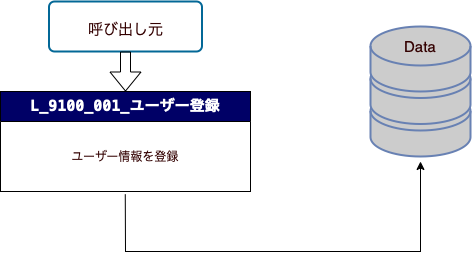

# ユーザー登録一覧API。
 - ユーザー登録データ用を作成する。
##　API レイアウト
  
## API 一覧
|No|Id|API名|備考|
|-|-|-|-|
|1|L_9100_001|ユーザー登録||

## エンティティ
|No|Id|エンティティ名|備考|
|-|-|-|-|
|1|UserInfo|ユーザー情報||
>## L_9100_001_ユーザー登録（userInfo/createAccount）
 - 取得したUserInfoの情報を登録する。
### INPUT 
 - [UserInfo](#userinfo)
### OUTPUT 
 - [UserResponse](#userresponse)
### メソッド
 - POST
### APIの詳細処理
>1.　INPUT データをチェックする。
-  UserResponse.codeStatus = 400 なる場合、
      - メッセージ内容：「ユーザー情報不正です。再確認ください。」
>2.　DBに接続する。
 - INPUT: UserInfo エンティティ。
 - OUTPUT: 
   -  Code Status = 500 なる場合、
      - メッセージ内容：「システムにエラー発生しました。あらためて再登録してください。」
   -  Code Status = 202 なる場合、
      - メッセージ内容：「アカウント存在した。新しアカウントを登録ください。」
   -  Code Status = 201 なる場合、
      - メッセージ内容：「登録完成しました。」
# UserInfo
@import "L_9100_input一覧.md"
# UserResponse
@import "L_9100_output一覧.md"
